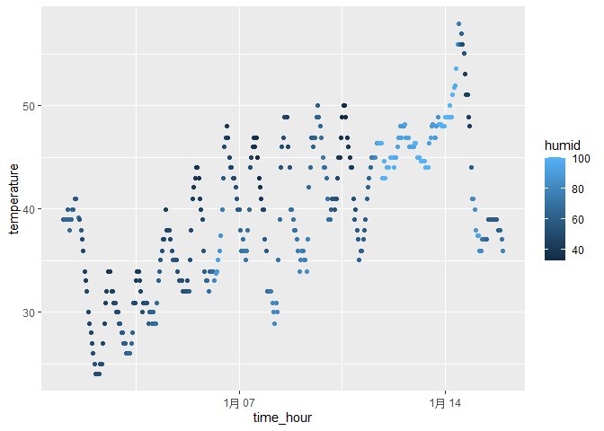

p8105_hw1_yz4719
================
Yuxin Zhang
2023-09-15

``` r
library(tidyverse)
```

    ## ── Attaching core tidyverse packages ──────────────────────── tidyverse 2.0.0 ──
    ## ✔ dplyr     1.1.3     ✔ readr     2.1.4
    ## ✔ forcats   1.0.0     ✔ stringr   1.5.0
    ## ✔ ggplot2   3.4.3     ✔ tibble    3.2.1
    ## ✔ lubridate 1.9.2     ✔ tidyr     1.3.0
    ## ✔ purrr     1.0.2     
    ## ── Conflicts ────────────────────────────────────────── tidyverse_conflicts() ──
    ## ✖ dplyr::filter() masks stats::filter()
    ## ✖ dplyr::lag()    masks stats::lag()
    ## ℹ Use the conflicted package (<http://conflicted.r-lib.org/>) to force all conflicts to become errors

``` r
library(moderndive)
data("early_january_weather")
```

# Question 1.1: description of the dataset

This data set contains a early January weather of EWR at the year 2013
through out 15 days including variables: origin, year, month, day, hour,
temp, dewp, humid, wind_dir, wind_speed, wind_gust, precip, pressure,
visib, time_hour.

During this 15 days, EWR has a mean temperature of 39.5821229, standard
deviation 7.058637, a mean humid of 65.4767039, and a mean pressure of
NA.

The size of this data set is 358 rows \* 15 columns.

The mean of the temperature is 39.5821229 degrees.

# Question 1.2: Make a scatterplot

This scatter plot shows the relationship between time and temperature,
the temperature increase as the time increase, the humidity also
increase but not related close as the temperature and time does. Both
humidity and temperature reached maxium around January 14th.

``` r
plot_temphumid = tibble(
  time_hour = early_january_weather$time_hour,
  temperature = early_january_weather$temp,
  humid = early_january_weather$humid
)

ggplot(plot_temphumid, aes(x = time_hour, y = temperature, color =  humid
)) + geom_point()
```

<!-- -->

``` r
ggsave("hw1_plot_1.png")
```

    ## Saving 7 x 5 in image

# Question 2:

``` r
sample_2 = tibble(
  samp = rnorm(10),
  vec_logical = samp > 0,
  vec_char = c("my", "name", "is", "samantha", "and", "this", "should", "be", "ten", "words"),
  vec_factor = factor(c("low", "high", "middle", "high", "middle", "middle", "low", "middle", "high", "low" ))
  )
```

## means

``` r
random_mean = mean(pull(sample_2, samp))
logical_mean = mean(pull(sample_2, vec_logical))
char_mean = mean(pull(sample_2, vec_char))
```

    ## Warning in mean.default(pull(sample_2, vec_char)): argument is not numeric or
    ## logical: returning NA

``` r
factor_mean = mean(pull(sample_2, vec_factor))
```

    ## Warning in mean.default(pull(sample_2, vec_factor)): argument is not numeric or
    ## logical: returning NA

The mean function does not work on character and factor vector, but
works on random sample and logical vectors.

## Convert

``` r
con_logical=as.numeric(pull(sample_2,vec_logical))
con_logical
con_char=as.numeric(pull(sample_2,vec_char))
con_char
con_factor=as.numeric(pull(sample_2,vec_factor))
con_factor
```

When converting these variables, the logical and factor is able to use
“as.numeric” function to convert in to numeric variables, but the
character variables is not able to do the same thing because it is a
nominal data, and it does not have meaning. the logical variables can be
convert into 0 and 1, and the factor variables can convert in to 3
different levels as 1, 2, 3.
